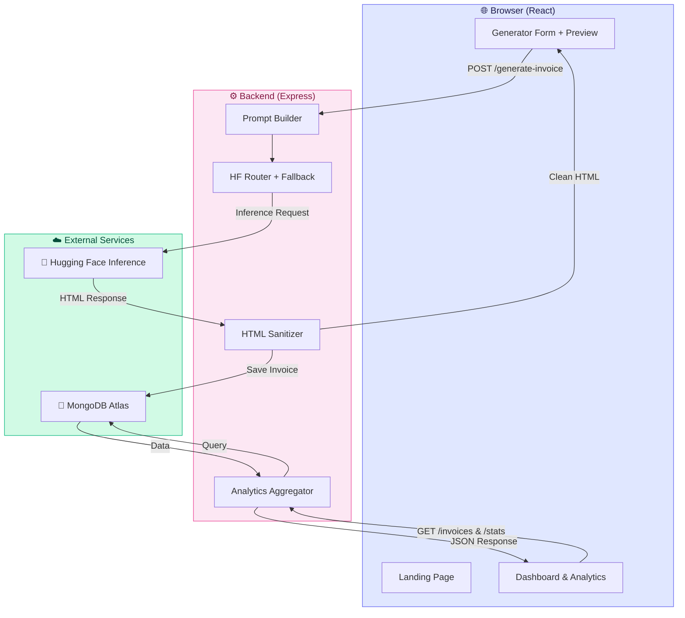
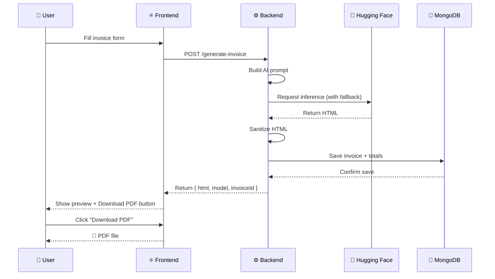

<div align="center">

# 🤖 InvoiceAI

### AI-Powered Invoice Generator

**Generate stunning, professional, GST-ready invoices in seconds with the power of AI.**

[](https://reactjs.org/)
[](https://nodejs.org/)
[](https://expressjs.com/)
[](https://www.mongodb.com/atlas)
[](https://huggingface.co/)
[](./LICENSE)

[](http://makeapullrequest.com)
[](#)

[Overview](#-overview) · [Features](#-features) · [Tech Stack](#-tech-stack) · [Setup](#-installation) · [API](#-api-reference) · [Roadmap](#-roadmap)

</div>

---

## 📖 Overview

**InvoiceAI** is a full-stack, production-ready invoicing platform that uses **free Hugging Face AI models** to generate clean, professional, print-ready HTML invoices. It handles everything from GST calculation to per-item tax breakdowns, PDF export, dashboard analytics, and secure MongoDB storage.

Whether you're a freelancer, an agency, or a small business — you can create your first beautiful invoice in **under 30 seconds**, with no signup required.

> 💡 **Why InvoiceAI?** Stop fighting Word templates. Get accurate, GST-compliant, professional invoices out the door in minutes — not hours.

---

## ✨ Features

### 🎨 Frontend (React)

| Feature | Description |
|---|---|
| 🏠 **Premium SaaS Landing Page** | Hero, features, how it works, showcase, benefits, testimonials, CTA, footer |
| 🪄 **AI-Powered Generation** | Sends structured data to backend, receives polished HTML |
| 📅 **Native Calendar Pickers** | Real `<input type="date">` for invoice and due dates |
| 🔢 **Auto-Increment Invoice #** | `INV-2026-001`, `INV-2026-002`, etc. |
| 🧮 **Per-Item Tax Mode** | Choose between Simple GST or split CGST / SGST / IGST |
| 💰 **Live Totals + Amount in Words** | Subtotal, discount, tax, grand total with words |
| 📋 **Duplicate / Remove Items** | One-click row actions |
| 🔄 **Reset Form** | Clears draft and regenerates a fresh invoice number |
| 💾 **Draft Auto-Save** | Every keystroke is saved to `localStorage` |
| 🌗 **Dark / Light Mode** | Persistent theme toggle across all pages |
| 📄 **PDF Export** | Print-ready A4 PDF via `jsPDF` + `html2canvas` |
| 📊 **Dashboard & Analytics** | Revenue chart, invoice history, search, filters, pagination |
| 📱 **Fully Responsive** | Optimized for desktop, tablet, and mobile |
| 🎨 **Glassmorphism UI** | Modern gradients, animations, hover effects |

### 🧠 Backend (Node.js + Express)

| Feature | Description |
|---|---|
| 🔎 **Free AI Model Discovery** | Dynamically fetches all live, zero-cost models from Hugging Face |
| 🏆 **Smart Model Scoring** | Prioritizes `gpt-oss`, `qwen`, `llama`, `mistral`, `gemma` |
| 🔀 **Automatic Fallback** | If one model fails, tries the next until one succeeds |
| ⚡ **10-Minute Model Cache** | Reduces API calls and improves response time |
| 🧹 **HTML Sanitization** | Strips `<style>`, `<script>`, `<html>`, `<head>`, `<body>` |
| 💽 **MongoDB Storage** | Full invoice snapshots, totals, and generated HTML |
| 📈 **Analytics Endpoints** | `/invoices`, `/stats`, `/invoices/:id`, and more |
| 🛡️ **Comprehensive Error Handling** | Detailed error logs for every failure |

---

## 🧰 Tech Stack

<table>
<tr>
<td valign="top" width="33%">

### Frontend
- ⚛️ React 18
- 🌐 Axios
- 📄 jsPDF
- 🖼️ html2canvas
- 🎨 Font Awesome
- 🔤 Google Fonts (Inter)
- 💅 Custom CSS3 (no framework)

</td>
<td valign="top" width="33%">

### Backend
- 🟢 Node.js 18+
- 🚂 Express 4
- 🍃 Mongoose (MongoDB ODM)
- 🤗 Hugging Face Inference Router
- 🤖 OpenAI SDK (HF-compatible)
- 🔒 CORS
- 🔑 dotenv

</td>
<td valign="top" width="33%">

### Infrastructure
- 🗄️ MongoDB Atlas (free tier)
- 🚀 Hugging Face Inference
- ☁️ Render (backend hosting)
- ▲ Vercel / Netlify (frontend)

</td>
</tr>
</table>

---

## 🏗️ Architecture



---

## 📂 Folder Structure

```
invoice-ai/
├── client/                          # React frontend
│   ├── public/
│   │   └── index.html
│   ├── src/
│   │   ├── pages/
│   │   │   └── LandingPage.jsx      # Premium SaaS homepage
│   │   ├── Dashboard.jsx            # Analytics + history
│   │   ├── App.js                   # Main generator + routing
│   │   ├── App.css                  # All styles (dark/light)
│   │   ├── index.js
│   │   └── utils/
│   │       └── numberToWords.js     # Auto #, storage, amount-in-words
│   ├── package.json
│   └── .env
│
├── server/                          # Express backend
│   ├── index.js                     # All routes + HF logic
│   ├── package.json
│   └── .env
│
├── .gitignore
├── README.md
└── LICENSE
```

---

## 🚀 Installation

### Prerequisites

| Tool | Version | Purpose |
|---|---|---|
| **Node.js** | ≥ 18 | Runtime |
| **npm** or **yarn** | latest | Package manager |
| **MongoDB Atlas** | free tier | Database |
| **Hugging Face** | free | AI inference |

### 1️⃣ Clone the Repository

```bash
git clone https://github.com/your-username/invoice-ai.git
cd invoice-ai
```

### 2️⃣ Set Up the Backend

```bash
cd server
npm install
```

Create a `.env` file inside `server/`:

```env
PORT=5001
HF_TOKEN=hf_xxxxxxxxxxxxxxxxxxxxxxxxxxxxxx
MONGO_URI=mongodb+srv://<user>:<pass>@cluster.mongodb.net/invoiceDB
```

<details>
<summary><b>🔑 How to get your tokens</b></summary>

<br>

**HF_TOKEN**
1. Go to [huggingface.co/settings/tokens](https://huggingface.co/settings/tokens)
2. Click **"New token"** → choose **Read** access
3. Copy the token (starts with `hf_`)

**MONGO_URI**
1. Create a free account on [cloud.mongodb.com](https://cloud.mongodb.com)
2. Create an **M0 Free Cluster**
3. Click **Connect** → **Drivers** → copy the connection string
4. Replace `<user>`, `<pass>`, and add `/invoiceDB` at the end

</details>

<br>

Start the backend:

```bash
npm start
# or in dev mode:
nodemon index.js
```

You should see:

```
✅ MongoDB connected
🚀 Server running on port 5001
🤖 AI: Hugging Face
```

### 3️⃣ Set Up the Frontend

In a **new terminal**:

```bash
cd client
npm install
npm start
```

> 📝 **Note:** If your backend is not on `http://localhost:5001`, update the API base URL inside:
> - `client/src/App.js` → search for `axios.post`
> - `client/src/Dashboard.jsx` → search for `const API`

The app opens at **http://localhost:3000** 🎉

---

## 📡 API Reference

All endpoints served by the Express backend.

| Method | Endpoint | Description |
|:------:|----------|-------------|
|  | `/` | Health check — confirms the server is up |
|  | `/debug/huggingface` | Diagnostics — lists all live, free HF providers |
|  | `/ai/models` | Returns the sorted list of currently-free AI models |
|  | `/ai/models/refresh` | Force-refreshes the model cache |
|  | `/generate-invoice` | Generates an invoice via AI, saves it, returns HTML |
|  | `/invoices` | Paginated list. Query: `page`, `limit`, `client`, `from`, `to`, `search` |
|  | `/invoices/:id` | Get a single invoice (includes full HTML) |
|  | `/invoices/:id` | Delete one invoice |
|  | `/stats` | Dashboard aggregates: totals, monthly, growth %, 14-day chart |

### Example: Generate an Invoice

<details>
<summary><b>📤 Request</b> — <code>POST /generate-invoice</code></summary>

<br>

```json
{
  "company": {
    "name": "Zohaib Company",
    "address": "71/A Colootola Street",
    "email": "iamzohaib777@gmail.com",
    "phone": "7003026496",
    "gst": "29ABCDE1234F1Z2",
    "bank": {
      "name": "HDFC Bank",
      "account": "XXXX XXXX 1234",
      "ifsc": "HDFC0001234",
      "branch": "Park Street, Kolkata",
      "upi": "zohaib@upi"
    }
  },
  "client": {
    "name": "Acme Corp",
    "address": "Mumbai",
    "phone": "9999999999"
  },
  "invoiceMeta": {
    "number": "INV-2026-001",
    "date": "2026-09-17",
    "due": "2026-10-17",
    "terms": "UPI",
    "po": ""
  },
  "items": [
    {
      "description": "Web Design",
      "quantity": "1",
      "price": "25000",
      "taxType": "gst18"
    }
  ],
  "discount": 5,
  "gstPercent": 18,
  "taxMode": "simple",
  "totals": {
    "subtotal": 25000,
    "discountAmount": 1250,
    "gstAmount": 4275,
    "total": 28025
  }
}
```

</details>

<details>
<summary><b>📥 Response</b></summary>

<br>

```json
{
  "success": true,
  "html": "<div>...</div>",
  "model": "openai/gpt-oss-120b:groq",
  "provider": "groq",
  "invoiceId": "65f8c1e2ab..."
}
```

</details>

---

## 🔄 How It Works



---

## ☁️ Deployment

### Frontend → Vercel

1. Push your code to GitHub
2. Import the repo on [vercel.com](https://vercel.com)
3. Set **Root Directory** to `client/`
4. Add env var `REACT_APP_API_URL` = your backend URL
5. Deploy 🎉

### Backend → Render

1. Create a **New Web Service** on [render.com](https://render.com)
2. Connect your GitHub repo
3. Set **Root Directory** to `server/`
4. Build Command: `npm install`
5. Start Command: `npm start`
6. Add environment variables:
   - `HF_TOKEN`
   - `MONGO_URI`
7. Deploy 🚀

### Database → MongoDB Atlas

1. Create a free **M0 cluster**
2. **Network Access** → Allow `0.0.0.0/0` (or your host's IP)
3. **Database Access** → create a user with read/write
4. Copy the connection string → paste into `.env` as `MONGO_URI`

> 🛡️ **Pro tip:** Add your Vercel URL to the CORS `origin` array in `server/index.js` before deploying.

---

## 🗺️ Roadmap

- [x] AI-powered invoice generation
- [x] GST / CGST / SGST / IGST support
- [x] Per-item tax mode
- [x] PDF export
- [x] Dashboard & analytics
- [x] Dark / light mode
- [x] Draft auto-save
- [ ] 🔐 Multi-user authentication (JWT)
- [ ] 📧 Email delivery via Nodemailer
- [ ] 📊 CSV export of invoice history
- [ ] 🔁 Recurring invoices with `node-cron`
- [ ] 🎨 Multiple template designs
- [ ] 📱 WhatsApp share link
- [ ] 💱 Multi-currency support
- [ ] 🌐 i18n (English, Hindi, Spanish)

---

## ❓ FAQ

<details>
<summary><b>Is this really free to use?</b></summary>

Yes! Hugging Face offers zero-cost inference providers for many open models, and we dynamically use only those. MongoDB Atlas also has a generous free tier.
</details>

<details>
<summary><b>Do I need a credit card to get started?</b></summary>

No. Both Hugging Face and MongoDB Atlas allow sign-up without a card for their free tiers.
</details>

<details>
<summary><b>What happens if the AI model fails?</b></summary>

The backend automatically falls back to the next highest-scoring free model, so your request never dies silently. If all models fail, you'll receive a clear error response.
</details>

<details>
<summary><b>Is my invoice data safe?</b></summary>

All data is stored in **your own MongoDB cluster**. We never share it with third parties beyond the AI prompt itself. The AI prompt contains only what's needed to generate the HTML.
</details>

<details>
<summary><b>Can I use this for my business / commercial project?</b></summary>

Absolutely — it's **MIT-licensed**. Use it, modify it, self-host it, or build commercial services around it.
</details>

<details>
<summary><b>How do I change the currency from ₹ (INR)?</b></summary>

Search the codebase for `₹` and replace it with your symbol. Alternatively, add a currency selector to the form — see `App.js` and `App.css` for the totals section.
</details>

<details>
<summary><b>Can I add more tax rates?</b></summary>

Yes — edit the `rateMap` in `App.js` (`calculateTotals` function) and the `<select>` options in the item rows. The backend prompt builder in `server/index.js` also has a `taxLabel` map you can extend.
</details>

---

## 🤝 Contributing

Contributions of any size are welcome! Here's how:

```bash
# 1. Fork the repo

# 2. Create your feature branch
git checkout -b feature/amazing-feature

# 3. Commit your changes
git commit -m 'Add some amazing feature'

# 4. Push to the branch
git push origin feature/amazing-feature

# 5. Open a Pull Request
```

Please make sure to:
- ✅ Update the README if you add new features
- ✅ Follow the existing code style
- ✅ Add tests where applicable
- ✅ Keep PRs focused and descriptive

---

## 📜 License

Distributed under the **MIT License**. See [`LICENSE`](./LICENSE) for more information.

---

## 🙏 Acknowledgements

- [Hugging Face](https://huggingface.co/) — for free AI inference
- [MongoDB Atlas](https://www.mongodb.com/atlas) — for generous free-tier hosting
- [React](https://reactjs.org/), [Express](https://expressjs.com/), [Node.js](https://nodejs.org/)
- [Font Awesome](https://fontawesome.com/) — for the beautiful icons
- [Inter](https://rsms.me/inter/) — for the elegant typeface

---

<div align="center">

### ⭐ Star this repo if you find it useful!

**Built with ❤️ for freelancers, agencies, and small businesses.**

[⬆ Back to Top](#-invoiceai)

</div>